<p align="center">

&#x20; 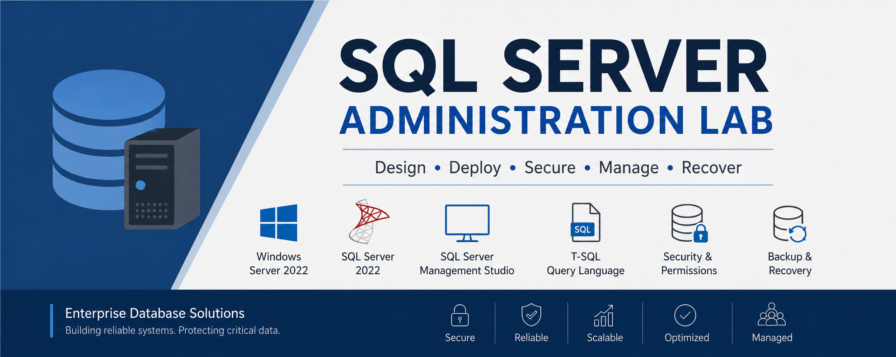

</p>


\# SQL Server Administration Lab


<p align="center">


!\[Windows Server](https://img.shields.io/badge/Windows\_Server-2022-0078D4?style=for-the-badge\&logo=windows\&logoColor=white)

!\[SQL Server](https://img.shields.io/badge/SQL\_Server-2022-CC2927?style=for-the-badge\&logo=microsoftsqlserver\&logoColor=white)

!\[SSMS](https://img.shields.io/badge/SSMS-Management\_Studio-0078D4?style=for-the-badge)

!\[T-SQL](https://img.shields.io/badge/T--SQL-T\_SQL-336791?style=for-the-badge)

!\[VirtualBox](https://img.shields.io/badge/Oracle\_VirtualBox-Lab-183A61?style=for-the-badge\&logo=virtualbox\&logoColor=white)

!\[GitHub](https://img.shields.io/badge/GitHub-Portfolio-181717?style=for-the-badge\&logo=github)


</p>


\---


\## Project Overview


This project demonstrates the installation, configuration, and administration of Microsoft SQL Server 2022 in a Windows Server 2022 virtual environment. A relational database named \*\*TechSolutions\*\* was created to simulate an enterprise help desk environment for managing employees, departments, and IT support tickets.


The project covers database design, SQL query development, security configuration, reporting, and backup management while following industry best practices for documentation and organization.


\---


\# Architecture


<p align="center">

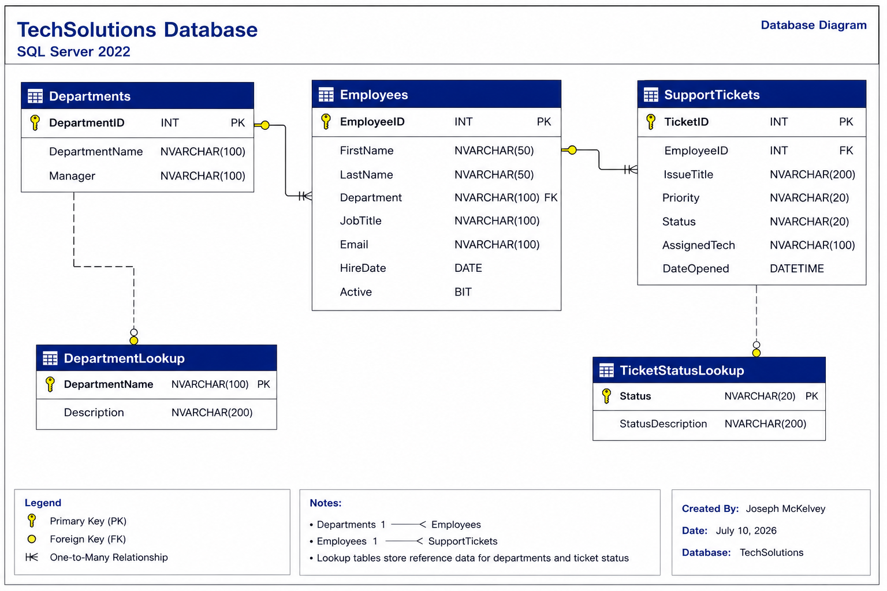

</p>


\---


\# Lab Environment


| Component | Technology |

|------------|------------|

| Operating System | Windows Server 2022 |

| Database | Microsoft SQL Server 2022 |

| Management Tool | SQL Server Management Studio (SSMS) |

| Language | T-SQL |

| Virtualization | Oracle VirtualBox |

| Version Control | Git \& GitHub |


\---


\# Technologies Used


\- Windows Server 2022

\- Microsoft SQL Server 2022

\- SQL Server Management Studio (SSMS)

\- T-SQL

\- Oracle VirtualBox

\- Git

\- GitHub


\---


\# Project Objectives


\- Install Microsoft SQL Server 2022

\- Configure SQL Server Management Studio

\- Create an enterprise SQL database

\- Design relational database tables

\- Implement primary and foreign keys

\- Populate sample data

\- Develop SQL queries and reports

\- Configure SQL authentication

\- Create database users and permissions

\- Perform database backup and recovery

\- Document the complete project


\---


\# Database Tables


\## Employees


Stores employee information.


\- EmployeeID

\- FirstName

\- LastName

\- Department

\- JobTitle

\- Email

\- HireDate

\- Active


\---


\## Departments


Stores department information.


\- DepartmentID

\- DepartmentName

\- Manager


\---


\## SupportTickets


Stores internal help desk support tickets.


\- TicketID

\- EmployeeID

\- IssueTitle

\- Priority

\- Status

\- AssignedTech

\- DateOpened


\---


\# SQL Scripts


| Script | Purpose |

|---------|---------|

| 01\_Create\_Database.sql | Create the TechSolutions database |

| 02\_Create\_Tables.sql | Create relational tables |

| 03\_Insert\_Data.sql | Populate sample data |

| 04\_Basic\_Queries.sql | SQL queries and filtering |

| 05\_Joins.sql | Relational JOIN reports |

| 06\_Security.sql | SQL logins, users, and permissions |

| 07\_Backup.sql | Full database backup |

| 08\_Restore\_Database.sql | Database restore |


\---


\# Features Implemented


\- SQL Server installation

\- SQL Server Management Studio configuration

\- Relational database design

\- Primary Keys

\- Foreign Keys

\- Sample data population

\- SQL filtering

\- Aggregate queries

\- INNER JOIN reports

\- Database security

\- SQL authentication

\- User permissions

\- Database backup

\- Database restore


\---


\# Project Walkthrough


\## SQL Server Installation


Installed Microsoft SQL Server 2022 Developer Edition on Windows Server 2022.


<p align="center">
  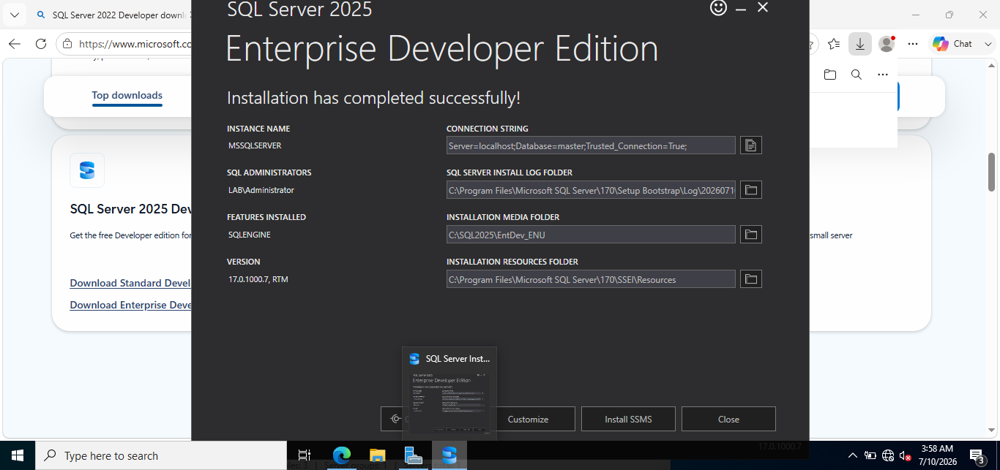
</p>


\---


\## SQL Server Management Studio


Installed SQL Server Management Studio and connected to the SQL Server instance.


<p align="center">
  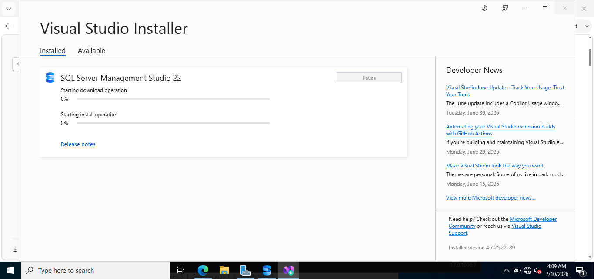
</p>


\---


\## SQL Server Connection


Verified connectivity to the SQL Server instance.


<p align="center">
  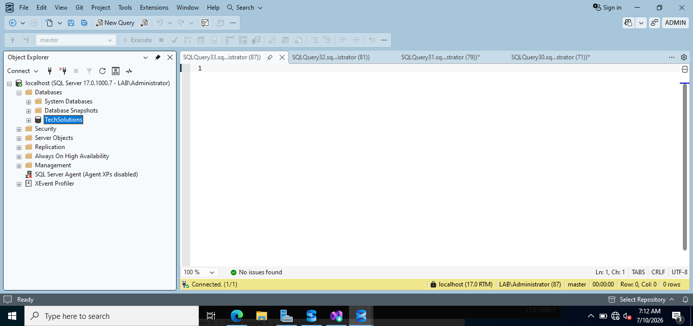
</p> 


\---


\## Database Creation


Created the TechSolutions production-style database.


<p align="center">
  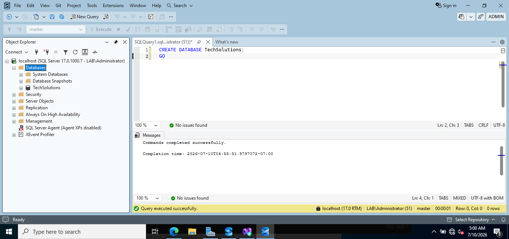
</p>


\---


\## Employees Table


Created the Employees table.


<p align="center">
  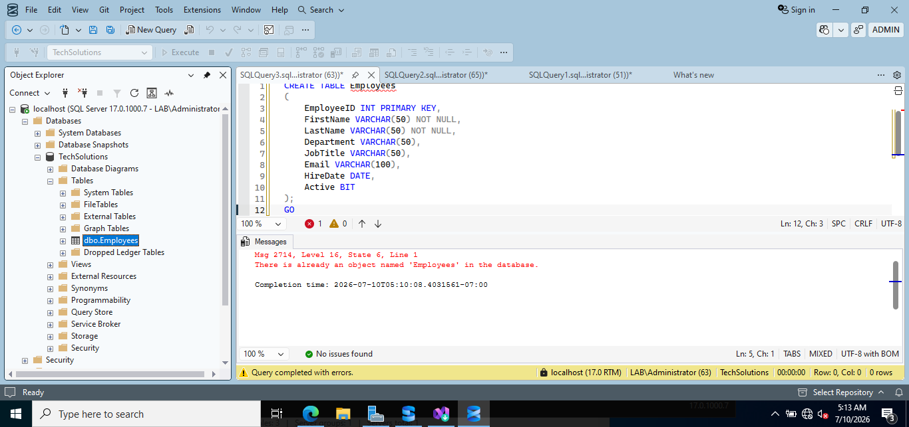
</p>


\---


\## Sample Employee Data


Inserted employee records into the database.


<p align="center">
  
</p>


\---


\## SQL Queries


Retrieved employee information using SELECT statements.


<p align="center">
  
</p>


\---


\## Filtering Results


Filtered employees by department.


<p align="center">
  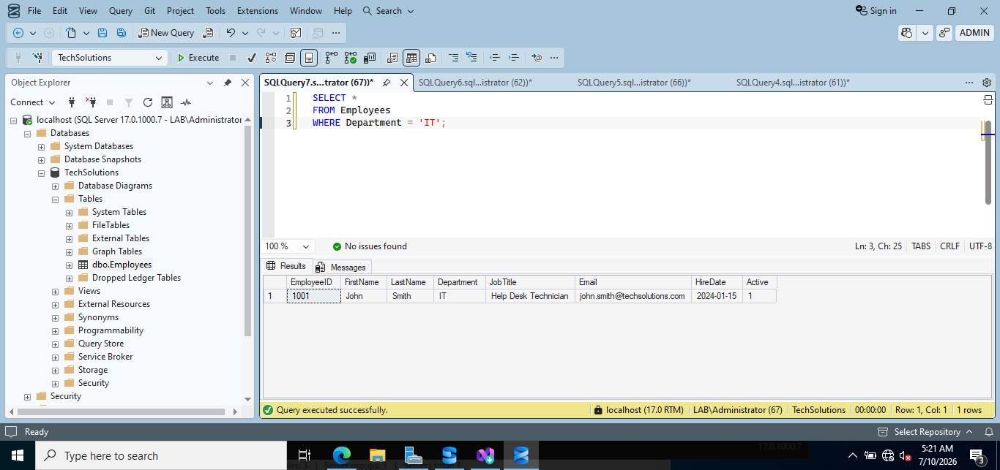
</p>


\---


\## Sorting Data


Sorted employee records.


<p align="center">
  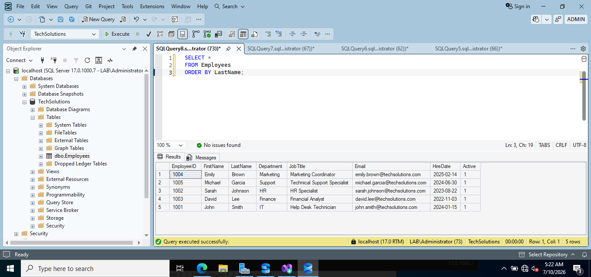
</p>


\---


\## Aggregate Functions


Calculated employee totals.


<p align="center">
  
</p>


\---


\## Active Employees


Displayed active employees.


<p align="center">
  
</p>


\---


\## Departments Table


Created the Departments table.


<p align="center">
  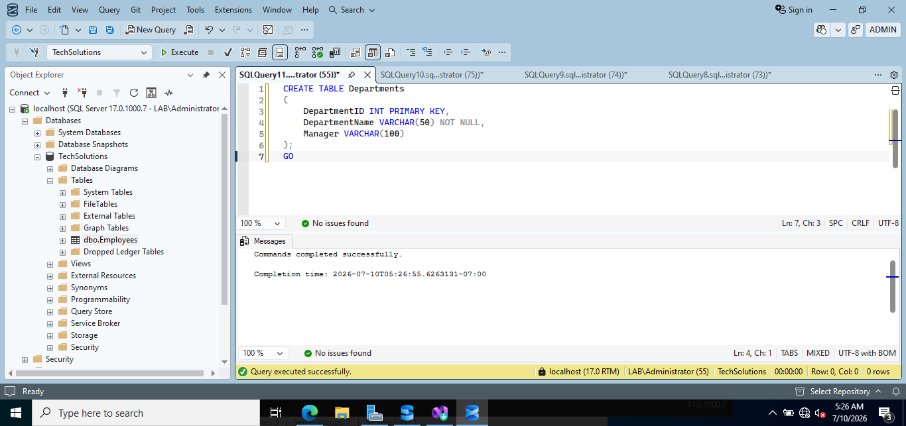
</p>


\---


\## Department Data


Inserted department information.


<p align="center">
  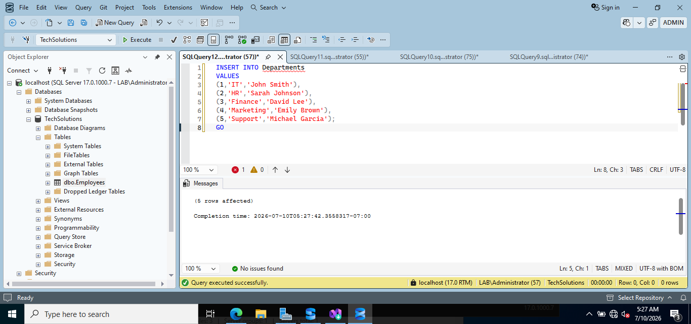
</p>


\---


\## Department Results


Verified department records.


<p align="center">
  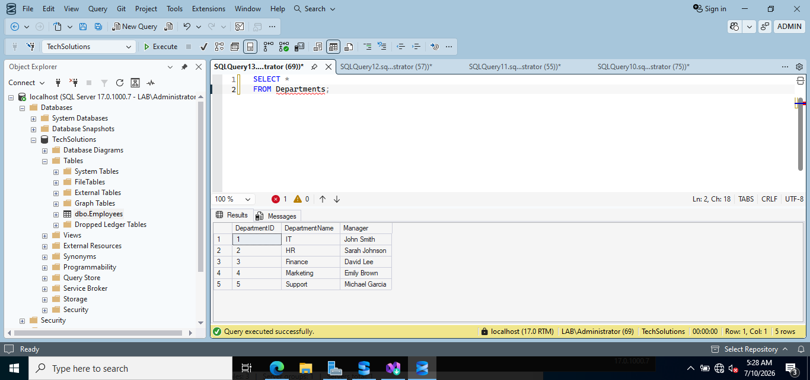
</p>


\---


\## Employee Department JOIN


Joined Employees and Departments tables.


<p align="center">
  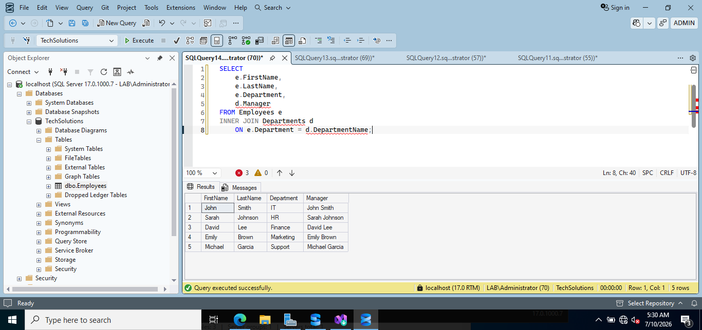
</p>


\---


\## Support Tickets


Created the SupportTickets table.


<p align="center">
  
</p>


\---


\## Ticket Reporting


Joined support tickets with employee records.


<p align="center">
  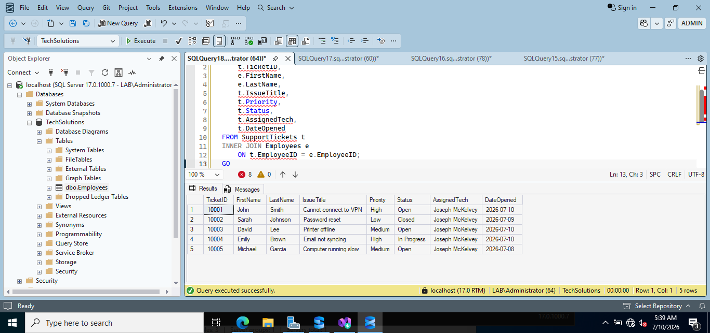
</p>


\---


\## Open Tickets


Displayed open support tickets.


<p align="center">
  
</p>


\---


\## High Priority Tickets


Filtered high-priority incidents.


<p align="center">
  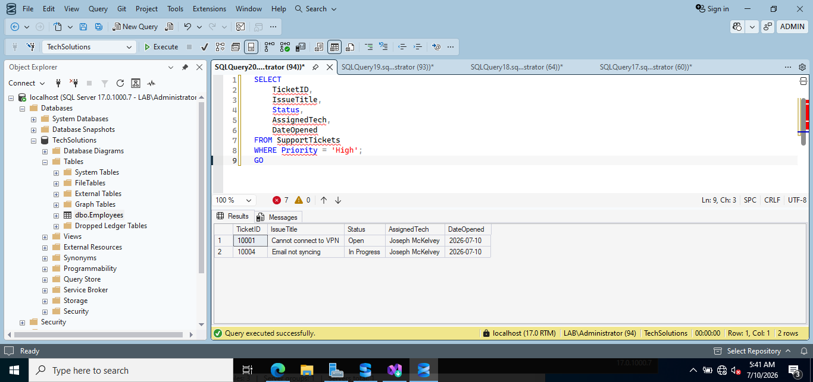
</p>


\---


\## Ticket Status Report


Grouped support tickets by status.


<p align="center">
  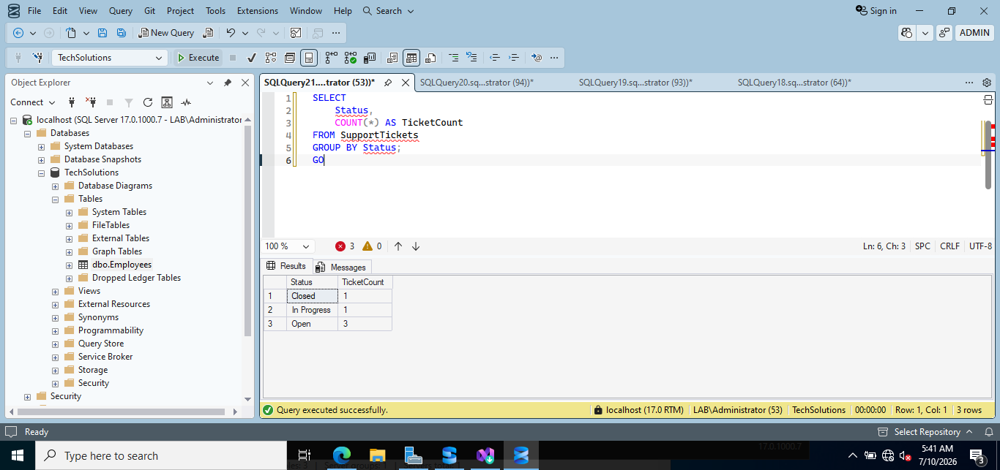
</p>


\---


\## Department Reporting


Grouped support tickets by department.


<p align="center">
  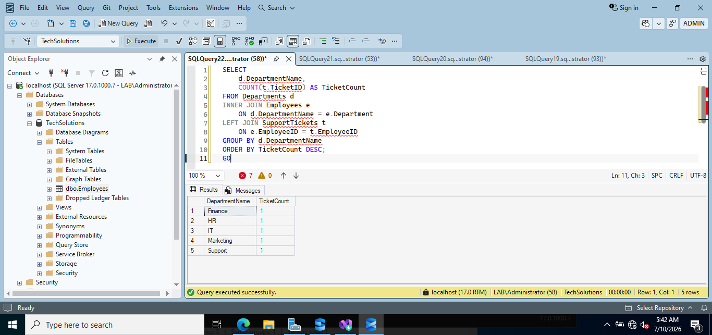
</p>


\---


\## Help Desk Dashboard Report


Created a complete reporting query using multiple JOIN statements.


<p align="center">
  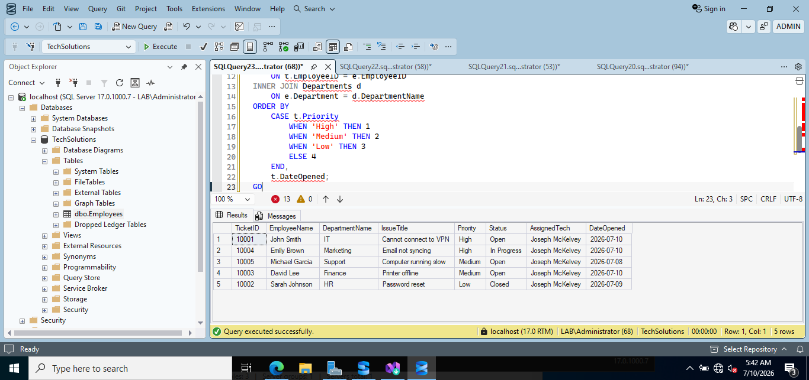
</p>


\---


\## SQL Security


Created a SQL login with read-only access.


<p align="center">
  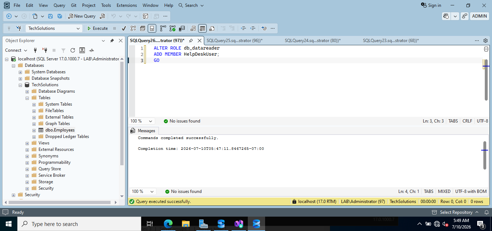
</p>


\---


\## Permission Verification


Verified that write operations were denied.


<p align="center">
  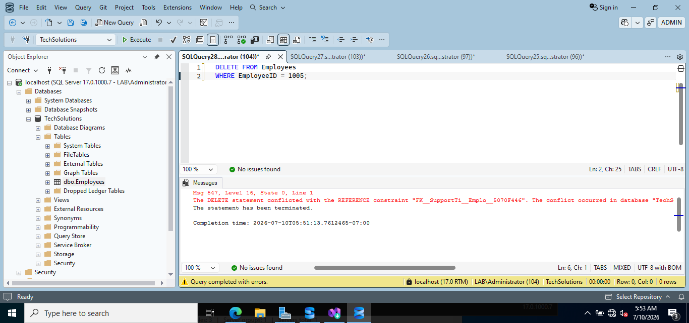
</p>


\---


\## Foreign Key Relationships


Verified relational integrity between tables.


<p align="center">
  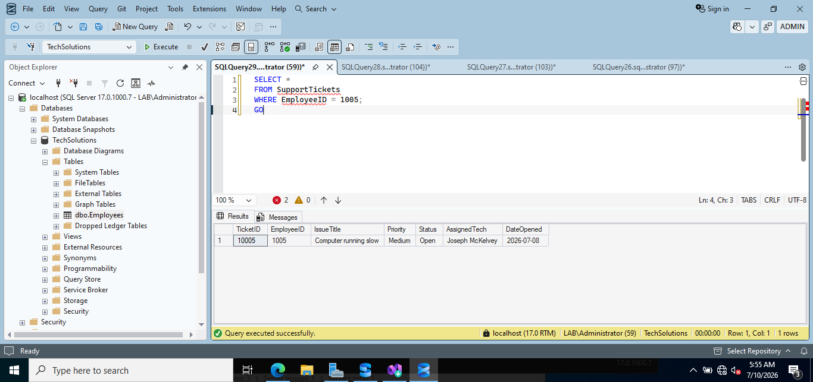
</p>


\---


\## Database Backup


Performed a successful SQL Server backup.


<p align="center">
  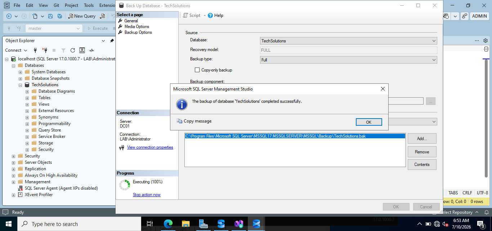
</p>


\---


\## Backup Verification


Verified the backup file was successfully created.


<p align="center">
  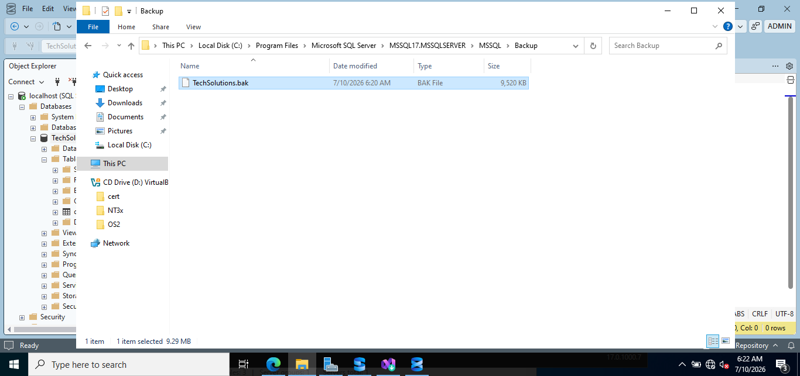
</p>


\---


\# Repository Structure


```text

SQL-Server-Administration-Lab

│

├── README.md

├── LICENSE

│

├── assets

│   ├── architecture

│   ├── banner

│   ├── diagrams

│   ├── icons

│   └── screenshots

│

├── documentation

│

└── SQL

&#x20;   ├── backups

&#x20;   ├── sample-data

&#x20;   └── scripts

```


\---


\# Skills Demonstrated


\- SQL Server Administration

\- Microsoft SQL Server 2022

\- SQL Server Management Studio

\- T-SQL

\- Relational Database Design

\- SQL Reporting

\- INNER JOIN Operations

\- Aggregate Functions

\- SQL Authentication

\- Database Security

\- Backup and Recovery

\- Windows Server Administration

\- Technical Documentation


\---


\# Learning Outcomes


This lab provided hands-on experience deploying and administering Microsoft SQL Server in a Windows Server environment. It reinforced core database administration concepts including relational database design, SQL development, security configuration, user permission management, and backup procedures while demonstrating practical skills commonly used in enterprise IT environments.


\---


\# Author


\*\*Joseph McKelvey\*\*


GitHub Portfolio Project

